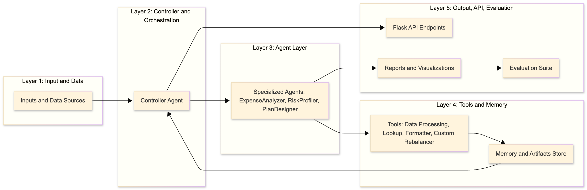
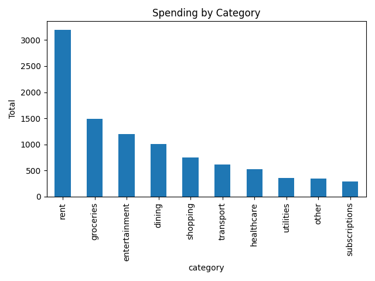
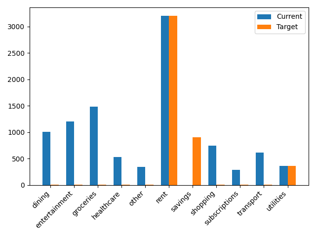

# FinGuardAI – Agentic Financial Wellness System
<p >
  
  
  
  
  
</p>

A multi-agent AI system for budgeting, risk scoring, and financial planning.

## 🔍 Overview

FinGuardAI is an advanced agentic AI system designed to analyze financial behavior, detect overspending risk, rebalance user budgets, and produce actionable financial recommendations.

Built with a structured **Controller → Agents → Tools → Memory → API** architecture, the system demonstrates:

✔ Multi-agent orchestration  
✔ Custom financial optimization tool  
✔ Intelligent risk scoring  
✔ Automated budgeting insights  
✔ Visualizations and API endpoints  
✔ Full evaluation suite with metrics  

This project is part of the **Building Agentic Systems** course at Northeastern University, and it is designed to be a portfolio-quality showcase of agentic system engineering.

## 🧱 Architecture


<p align="center">
  
</p>

<p align="center">
  <em>(Controller → Agents → Tools → Memory → API → Evaluation)</em>
</p>

## 📂 Project Structure

```
FinGuardAI/
│
├── data/                      # Input financial datasets (light, moderate, heavy, corner cases)
│   └── *.csv
│
├── outputs/                   # Auto-generated analysis results
│   ├── report.json            # Machine-readable summary
│   ├── report.md              # Human-readable Markdown report
│   ├── spend_by_category.png  # Visualization: category spending
│   ├── before_after_budget.png# Visualization: rebalance comparison
│   └── *.png                  # Additional plots
│
├── scripts/
│   └── generate_data.py       # Synthetic dataset generator
│
├── src/
│   ├── agents/
│   │   ├── agents.py          # ControllerAgent + specialized agents
│   │   └── __init__.py
│   │
│   ├── tasks/
│   │   ├── categorize.py      # Spending categorization logic
│   │   └── __init__.py
│   │
│   ├── tools/
│   │   ├── benchmarks.py      # Benchmark lookups (50/30/20 rule, caps)
│   │   ├── budget_rebalancer.py # Custom tool: SmartBudgetRebalancer
│   │   ├── formatter.py       # Markdown/JSON formatting utilities
│   │   └── __init__.py
│   │
│   ├── utils/
│   │   ├── cache.py           # Lightweight caching for repeated runs
│   │   ├── metrics.py         # Evaluation metrics utilities
│   │   ├── plots.py           # Matplotlib-based visualization tool
│   │   └── __init__.py
│   │
│   ├── api.py                 # Flask API (health, /analyze, /demo/<profile>)
│   ├── eval.py                # Automated multi-profile evaluation suite
│   └── main.py                # Entry point for local execution
│
├── .env                       # Environment variables (ignored in git)
├── .gitignore                 # Excludes venv, outputs, etc.
│
└── requirements.txt           # Python dependencies

```

## 🤖 System Components

### 🧩 1. Controller Agent

The brain of the system:

- Task routing
- Fallback & error handling
- Sequential orchestration
- Runtime logging
- Cache-aware execution

### 🧠 2. Specialized Agents

**ExpenseAnalyzer Agent**
- Cleans transactions
- Categorizes merchants
- Computes monthly spending distribution

**RiskProfiler Agent**
- Evaluates financial risk
- Compares spend vs benchmarks (50/30/20 rule)
- Generates benchmark flags

**PlanDesigner Agent**
- Uses SmartBudgetRebalancer to rebalance user budgets
- Generates deltas and recommendations
- Formats outputs into Markdown + JSON

### 🛠️ 3. Tools Used

- **Data Processor (Pandas)** – cleaning & transformation
- **Benchmark Lookup Tool** – category caps, rules
- **Formatter Tool** – Markdown/JSON report builder
- **Visualization Tool (Matplotlib)** – charts
- **Custom Tool: SmartBudgetRebalancer** (core of the system)

### 🧨 Custom Tool: SmartBudgetRebalancer

A custom-built optimization module that:

- Ensures ≥20% savings
- Reduces discretionary categories (shopping, dining)
- Protects essential categories (rent, utilities)
- Computes target allocation + deltas
- Supports fallback logic for missing categories

This tool is the **heart** of the "intelligent planning" component.

## 🔥 Key Features

✔ Multi-agent orchestration  
✔ Full API for interactive use  
✔ Multiple visualization outputs  
✔ Stress-tested on various spending profiles  
✔ Memory cache for accelerated performance  
✔ Complete evaluation suite  
✔ Clean JSON/Markdown pipeline  

## ▶️ Running FinGuardAI

### 1. CLI Execution

```bash
python src/main.py
```

Generates:
- `report.json`
- `report.md`
- `*.png` charts

### 2. Start the API

```bash
python -m src.api
```

Available Endpoints:
- `GET /health`
- `GET /demo/<profile>`
- `POST /analyze`

Sample:

```bash
curl -X POST http://127.0.0.1:5000/analyze \
  -H "Content-Type: application/json" \
  -d '{"income": 4500, "path": "data/moderate.csv"}'
```

## 📊 Example Outputs

<p align="center">
  
</p>

<p align="center">
  
</p>

## 🧪 Evaluation Suite

Run:

```bash
python -m src.eval
```

The suite evaluates:

| Test Case | What It Tests |
|-----------|---------------|
| Light | baseline detection |
| Moderate | overspend risk |
| Heavy | extreme imbalance |
| Corner Dining | stress test |
| Repeat (Cache) | runtime improvement |

Generates `evaluation_results.csv`.

## 📈 Key Findings

- Sub-0.4s runtime on all profiles
- Cache improves speed by ~90%
- Accurate risk scoring
- Robust behavior under extreme conditions
- Clean agent orchestration

## ⚠️ Limitations

- Heuristic merchant categorization
- Static benchmarks (50/30/20 rule)
- No multi-month forecasting
- Deterministic risk scoring
- No LLM-based reasoning (yet)

## 🚀 Future Improvements

- Train a merchant classifier model
- Personalized financial targets
- Trend-based analysis
- LLM natural-language advisor
- Reinforcement learning risk refinement
- Live financial API integration

## 🧑‍💻 Author

**Ritwik Giri**  
Master's in Information Systems  
Northeastern University – Boston  

## 📜 License

MIT License

---

⭐ **If you like this project, consider giving it a star!** 🌟
  Made with ❤️, Python, and Agentic AI.
